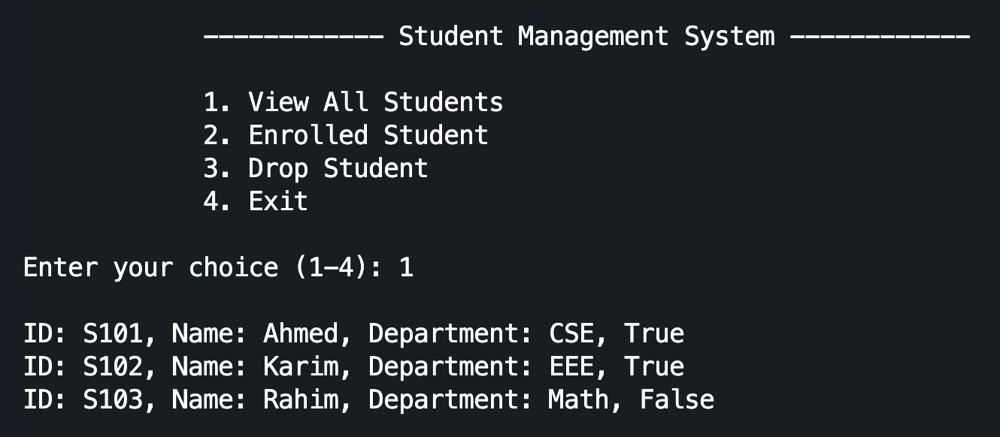
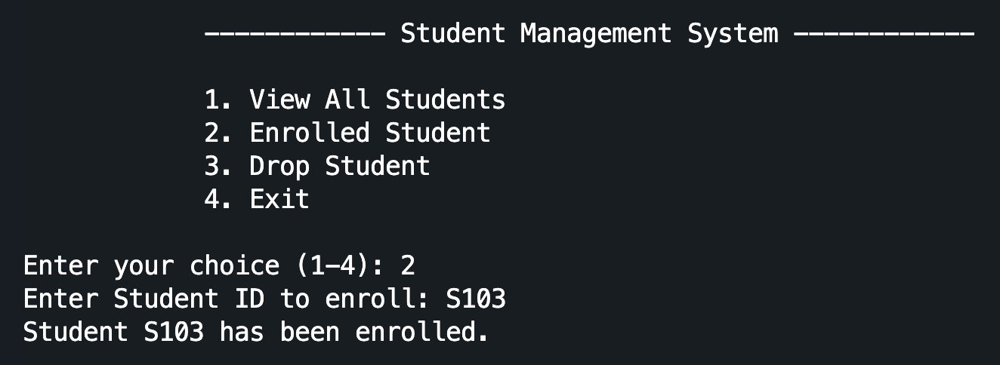
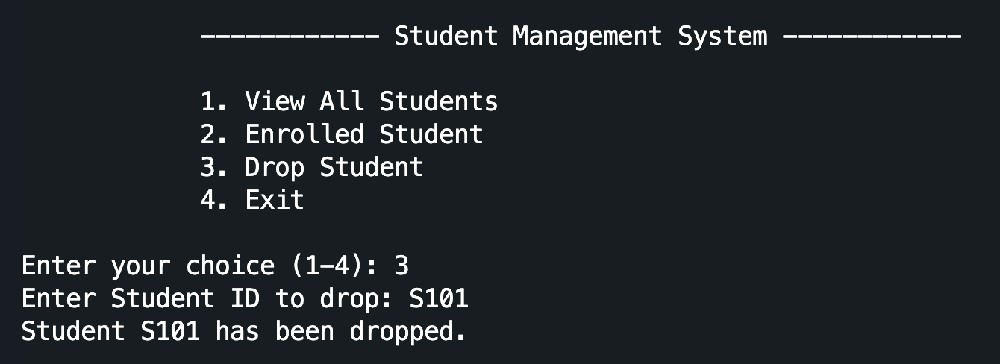
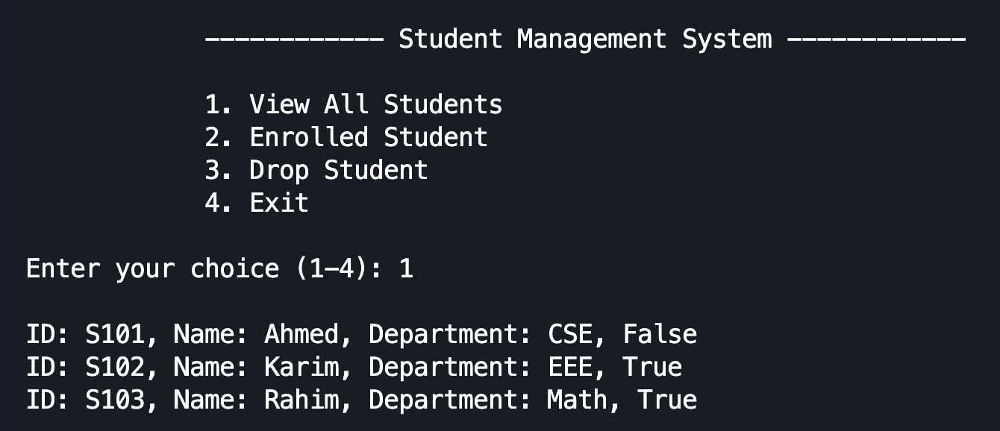
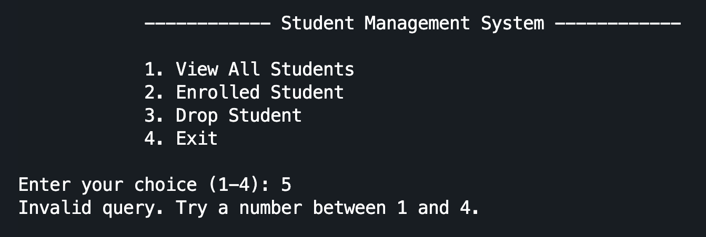
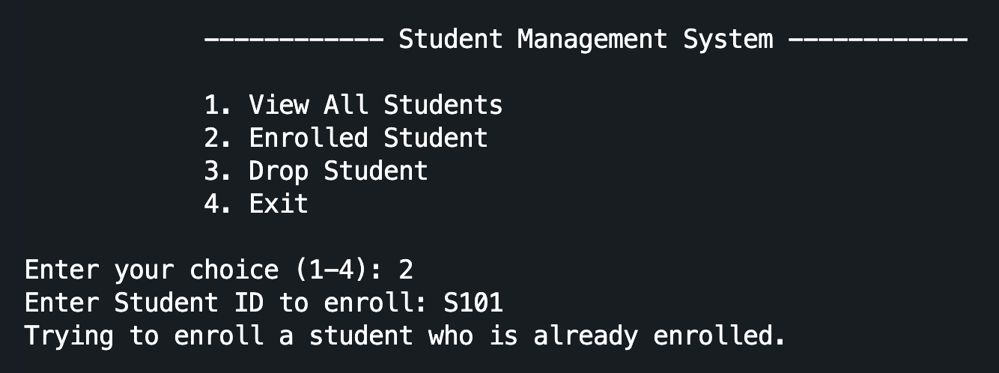
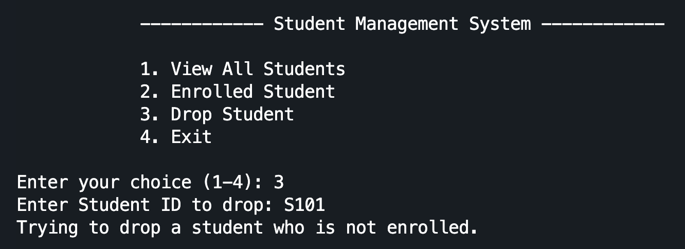
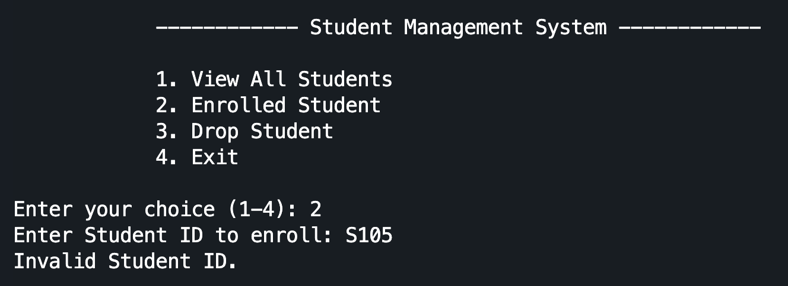
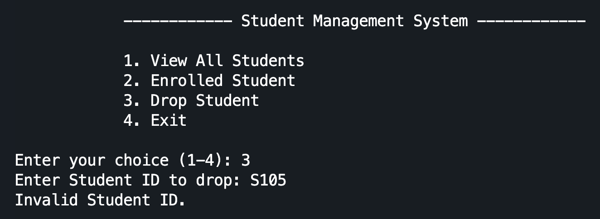
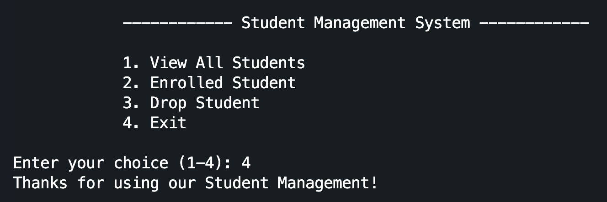

# student-management

### View All Students

### Enroll a Student

### Drop a Student

### After Drop a Student

## Error Messages

### Enter Invalid Menu Number

### Try Enroll Already Enrolled Student

### Try to Drop Not Enrolled Student

### Invalid Enroll ID

### Invalid Drop ID

### Exit

